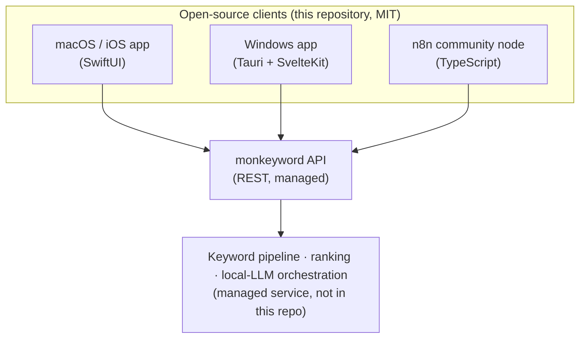
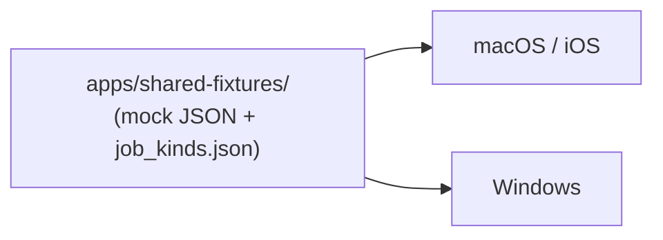

# Architecture (public overview)

This repository contains the **open-source clients** for monkeyword. They talk to
a hosted backend (a managed service) over a documented REST API.

## Components

## Open vs. managed

| Layer | Where | License |
|---|---|---|
| Clients (apps, n8n node) | this repository | MIT |
| Hosted backend (keyword data, ranking, local-LLM orchestration) | managed service | proprietary |

The clients are fully open and auditable. The hosted backend — which holds the
accumulated keyword data and runs the local LLM — is operated separately. See
[oss-strategy.md](oss-strategy.md) for the rationale.

## Shared contract

All clients render the same screens from the same data shapes. Sample data lives
in [`apps/shared-fixtures/`](../apps/shared-fixtures/) and the set of job kinds is
published in
[`apps/shared-fixtures/schema/job_kinds.json`](../apps/shared-fixtures/schema/job_kinds.json).

This is why screenshots line up 1:1 across macOS, iOS, and Windows.

## Mock mode (Phase 1)

In Phase 1 the clients run **fully offline** against the bundled fixtures. A
persistent "Mock Mode" banner is shown so it is always clear the data is sample
data. No backend, account, or API key is required to build and explore.

## Phase 2 (planned)

Clients connect to the hosted backend at `https://monkeyword.1stop.direct` over
REST. The data-access layer in each client is written so that only the
repository/datasource implementation swaps (mock → live); the UI and view models
stay the same.

- Apple: `MonkeywordRepository` protocol → mock vs. live implementation
- Windows: a Rust `DataSource` trait → mock vs. live implementation
- n8n node: `mockMode` credential toggle

## Privacy

All AI inference runs on a local LLM operated by the managed service. monkeyword
does not send your data to OpenAI, Claude, or Gemini.
